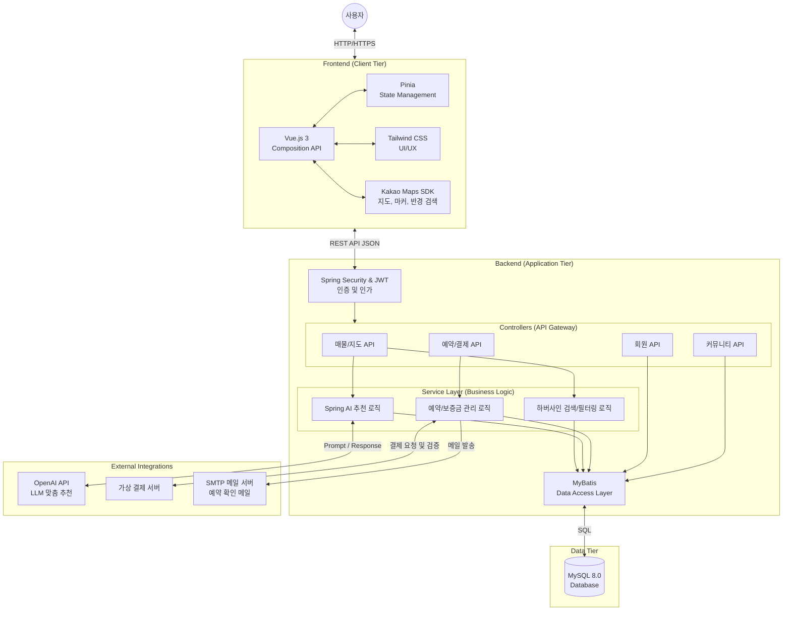

# 🏠 방방봐 (BangBangBwa) - 청년들을 위한 부동산 정보 플랫폼


> "**방** 구하러 멀리 가지 말고 **방**구석에서 찾아 **봐**!" 

---

## 📅 프로젝트 개요
- **진행 기간**: 2025.11.14 ~ 2025.12.26 (약 7주)
- **개발 인원**: 2명 (Full Stack)

## 👨‍💻 팀원 소개 (Team)

| 이름 | 역할 | 담당 기능 | GitHub |
| --- | --- | --- | --- |
| **함지수** | 팀장 / Full Stack | API 연동, AI 추천, UI/UX 디자인, 컴포넌트 구현, DB 설계, 매물 관리 | [@subakpup](https://github.com/subakpup) |
| **정혜원** | Full Stack | 회원, 토큰 관리, 보안 관리, 게시판, 결제 시스템, DB 설계 | [@Clarus23](https://github.com/Clarus23) |

## ✨ 주요 기능 (Key Features)

### 1. 🗺️ 지도 기반 매물 검색
- **Kakao Maps API**를 활용한 직관적인 지도 서비스
- **반경 검색**: 현재 내 위치 기준 반경 500m 이내 매물 필터링 (하버사인 공식 적용)
- **마커 클러스터링**: 다량의 매물 정보를 깔끔하게 시각화
- **편의시설 찾기**: 내 주변 버스정류장, 편의점, 지하철역 등 인프라 정보 제공

### 2. 🤖 AI 맞춤 매물 추천
- **Spring AI (OpenAI/LLM)** 연동
- 사용자가 원하는 인프라(예: 편의점, 학교, 지하철역 등)을 선택하면 AI가 최적의 매물을 분석하여 추천
- 추천된 매물 위치로 지도 자동 이동 및 하이라이팅

### 3. 🔍 스마트 필터링
- 거래 유형(매매/전세/월세), 가격대, 면적, 층수 등 상세 조건 검색
- 실시간 데이터 반영 및 리스트/지도 동기화

### 4. 💸 결제 시스템
- 방방봐 프로젝트만의 결제 서버 구축
- 원하는 결제 방식으로 가상 결제 가능

### 5. 🧐 노쇼 방지 보증금
- 미끼 상품 및 노쇼 방지를 위한 보증금 시스템
- 노쇼 발생 시 신고를 통해 보증금 몰수

### 6. 😎 동네 커뮤니티
- 동네 주민들만의 커뮤니티 게시판
- 지역을 선택해 해당 지역에 관한 소식 작성

---

## 🛠️ 기술 스택 (Tech Stack)

### **Backend**
| Tech | Detail |
| :-- | :-- |
| **Language** | Java 17 (Liberica JDK) |
| **Framework** | Spring Boot 3.5.9 |
| **Database** | MySQL 8.0 |
| **ORM** | MyBatis |
| **Security** | JWT, Spring Security |

### **Frontend**
| Tech | Detail |
| :-- | :-- |
| **Framework** | Vue.js 3 (Composition API) |
| **State Mngt** | Pinia |
| **Styling** | Tailwind CSS |
| **Map** | Kakao Maps SDK |
| **Icons** | Lucide Vue |

### **Collaboration**
- **IDE**: Visual Studio Code, Spring Tool Suite
- **VCS**: Git, GitHub
- **Communication**: Mattermost, Notion
- **Design**: Figma

---

## 📐 시스템 아키텍처 & ERD

### System Architecture


### ERD (Entity Relationship Diagram)


---

## 💻 실행 방법 (Getting Started)

### 1. Backend (Spring Boot)
```bash
# Repository Clone
git clone [Github 주소]

# application.properties 설정 (필수 키 값)
kakao.api.key=YOUR_KAKAO_KEY
openai.api.key=YOUR_OPENAI_KEY

# Run Application
./gradlew bootRun

```

### 2. Frontend (Vue.js)

```bash
# 의존성 설치
pnpm install

# 개발 서버 실행
pnpm dev

```

---

## 📷 스크린샷 (Screenshots)

### 메인 페이지


### 매물 리스트


### 매물 상세


### 인프라 확인


### AI 매물 추천


### AI 추천 모달


### 찜


### 찜 목록


### 예약하기


### 예약금 결제


### 마이페이지


### 내 정보 수정


### 내 매물 리스트(중개인)


### 예약 확인


### 예약 확인 메일


### 예약 관리


### 게시판


### 게시판 검색


### 게시글


### 로그인


### 회원가입


### 비밀번호 찾기

