# 🏠 방방봐


> "**방** 구하러 멀리 가지 말고 **방**구석에서 찾아 **봐**!"

## 📅 프로젝트 개요
- **진행 기간**: 2025.11.14 ~ 2025.12.26
- **개발 인원**: 2명

## 👨‍💻 팀원 소개

<div align="left">
  <table style="width: 100%; max-width: 800px; border-collapse: collapse;">
    <tr>
      <td align="center" width="50%">
        <a href="https://github.com/subakpup">
          
          <br />
          <b>👑 함지수</b>
        </a>
      </td>
      <td align="center" width="50%">
        <a href="https://github.com/Clarus23">
          
          <br />
          <b>🧑‍💻 정혜원</b>
        </a>
      </td>
    </tr>
    <tr>
      <td align="center">
        <b>Full Stack</b>
      </td>
      <td align="center">
        <b>Full Stack</b>
      </td>
    </tr>
  </table>
</div>

## ✨ 주요 기능

### 1. 🗺️ 지도 기반 매물 검색
- **Kakao Maps API**를 활용한 직관적인 지도 서비스
- **반경 검색**: 현재 내 위치 기준 반경 500m 이내 매물 필터링 (하버사인 공식 적용)
- **마커 클러스터링**: 다량의 매물 정보를 깔끔하게 시각화
- **편의시설 찾기**: 내 주변 버스정류장, 편의점, 지하철역 등 인프라 정보 제공

### 2. 🤖 AI 맞춤 매물 추천
- **Spring AI (OpenAI/LLM)** 연동
- 사용자가 원하는 인프라(예: 편의점, 학교, 지하철역 등)를 선택하면 AI가 최적의 매물을 분석하여 추천
- 추천된 매물 위치로 지도 자동 이동 및 하이라이팅

### 3. 🔍 스마트 필터링
- 거래 유형(매매/전세/월세), 가격대, 면적, 층수 등 상세 조건 검색
- 실시간 데이터 반영 및 리스트/지도 동기화

### 4. 💸 결제 시스템
- 방방봐 프로젝트만의 자체 가상 결제 서버 구축
- 원하는 결제 방식으로 가상 결제 진행 가능

### 5. 🧐 노쇼 방지 보증금
- 미끼 상품 및 노쇼 방지를 위한 보증금 시스템
- 노쇼 발생 시 신고를 통해 보증금 몰수 처리

### 6. 😎 동네 커뮤니티
- 동네 주민들만의 커뮤니티 게시판
- 지역을 선택해 해당 지역에 관한 소식 작성 및 공유

## 🛠️ 기술 스택

### **Backend**
| Tech | Detail |
| :-- | :-- |
| **Language** | Java 17 (Liberica JDK) |
| **Framework** | Spring Boot 3.5.9 |
| **Database** | MySQL 8.0 |
| **ORM** | MyBatis |
| **Security** | JWT, Spring Security |

### **Frontend**
| Tech | Detail |
| :-- | :-- |
| **Framework** | Vue.js 3 |
| **State Mngt** | Pinia |
| **Styling** | Tailwind CSS |
| **Map** | Kakao Maps SDK |
| **Icons** | Lucide Vue |

### **Collaboration**
- **IDE**: Visual Studio Code, Spring Tool Suite
- **VCS**: Git, GitHub
- **Communication**: Mattermost, Notion
- **Design**: Figma

## 📐 시스템 아키텍처 & ERD

### System Architecture

```mermaid
graph TB
    User((사용자))
    
    subgraph Frontend ["Frontend (Client Tier)"]
        Vue["Vue.js 3<br>Composition API"]
        Pinia["Pinia<br>State Management"]
        Tailwind["Tailwind CSS<br>UI/UX"]
        KakaoMap["Kakao Maps SDK<br>지도, 마커, 반경 검색"]
        
        Vue <--> Pinia
        Vue <--> Tailwind
        Vue <--> KakaoMap
    end
    
    subgraph Backend ["Backend (Application Tier)"]
        Security["Spring Security & JWT<br>인증 및 인가"]
        
        subgraph Controllers ["Controllers (API Gateway)"]
            PropertyAPI["매물/지도 API"]
            AuthAPI["회원 API"]
            BoardAPI["커뮤니티 API"]
            PayAPI["예약/결제 API"]
        end
        
        subgraph Services ["Service Layer (Business Logic)"]
            SearchLogic["하버사인 검색/필터링 로직"]
            AILogic["Spring AI 추천 로직"]
            TradeLogic["예약/보증금 관리 로직"]
        end
        
        MyBatis["MyBatis<br>Data Access Layer"]
        
        Security --> Controllers
        PropertyAPI --> SearchLogic
        PropertyAPI --> AILogic
        PayAPI --> TradeLogic
        
        SearchLogic --> MyBatis
        AILogic --> MyBatis
        TradeLogic --> MyBatis
        AuthAPI --> MyBatis
        BoardAPI --> MyBatis
    end
    
    subgraph DatabaseLayer ["Data Tier"]
        MySQL[(MySQL 8.0<br>Database)]
    end
    
    subgraph ExternalServices ["External Integrations"]
        OpenAI["OpenAI API<br>LLM 맞춤 추천"]
        PaymentServer["가상 결제 서버"]
        MailServer["SMTP 메일 서버<br>예약 확인 메일"]
    end
    
    User <-->|HTTP/HTTPS| Frontend
    Frontend <-->|REST API JSON| Security
    
    MyBatis <-->|SQL| MySQL
    
    AILogic <-->|Prompt / Response| OpenAI
    TradeLogic <-->|결제 요청 및 검증| PaymentServer
    TradeLogic -->|메일 발송| MailServer

```


### ERD

<div align="center">
    
</div>

## 💻 실행 방법

### 1. Backend (Spring Boot)

```bash
# Repository Clone
git clone [Github 주소]

# application.properties 설정 (필수 키 값)
kakao.api.key=YOUR_KAKAO_KEY
openai.api.key=YOUR_OPENAI_KEY

# Run Application
./gradlew bootRun

```

### 2. Frontend (Vue.js)

```bash
# 의존성 설치
pnpm install

# 개발 서버 실행
pnpm dev

```

## 📷 스크린샷

<table width="100%">
  <tr>
    <td align="center" width="50%">
      <br>
      <b>메인 페이지</b>
    </td>
    <td align="center" width="50%">
      <br>
      <b>매물 리스트</b>
    </td>
  </tr>
  <tr>
    <td align="center">
      <br>
      <b>매물 상세</b>
    </td>
    <td align="center">
      <br>
      <b>인프라 확인</b>
    </td>
  </tr>
  <tr>
    <td align="center">
      <br>
      <b>AI 매물 추천</b>
    </td>
    <td align="center">
      <br>
      <b>AI 추천 모달</b>
    </td>
  </tr>
  <tr>
    <td align="center">
      <br>
      <b>찜</b>
    </td>
    <td align="center">
      <br>
      <b>찜 목록</b>
    </td>
  </tr>
  <tr>
    <td align="center">
      <br>
      <b>예약하기</b>
    </td>
    <td align="center">
      <br>
      <b>예약금 결제</b>
    </td>
  </tr>
  <tr>
    <td align="center">
      <br>
      <b>마이페이지</b>
    </td>
    <td align="center">
      <br>
      <b>내 정보 수정</b>
    </td>
  </tr>
  <tr>
    <td align="center">
      <br>
      <b>내 매물 리스트(중개인)</b>
    </td>
    <td align="center">
      <br>
      <b>예약 확인</b>
    </td>
  </tr>
  <tr>
    <td align="center">
      <br>
      <b>예약 확인 메일</b>
    </td>
    <td align="center">
      <br>
      <b>예약 관리</b>
    </td>
  </tr>
  <tr>
    <td align="center">
      <br>
      <b>게시판</b>
    </td>
    <td align="center">
      <br>
      <b>게시판 검색</b>
    </td>
  </tr>
  <tr>
    <td align="center">
      <br>
      <b>게시글</b>
    </td>
    <td align="center">
      <br>
      <b>로그인</b>
    </td>
  </tr>
  <tr>
    <td align="center">
      <br>
      <b>회원가입</b>
    </td>
    <td align="center">
      <br>
      <b>비밀번호 찾기</b>
    </td>
  </tr>
</table>
